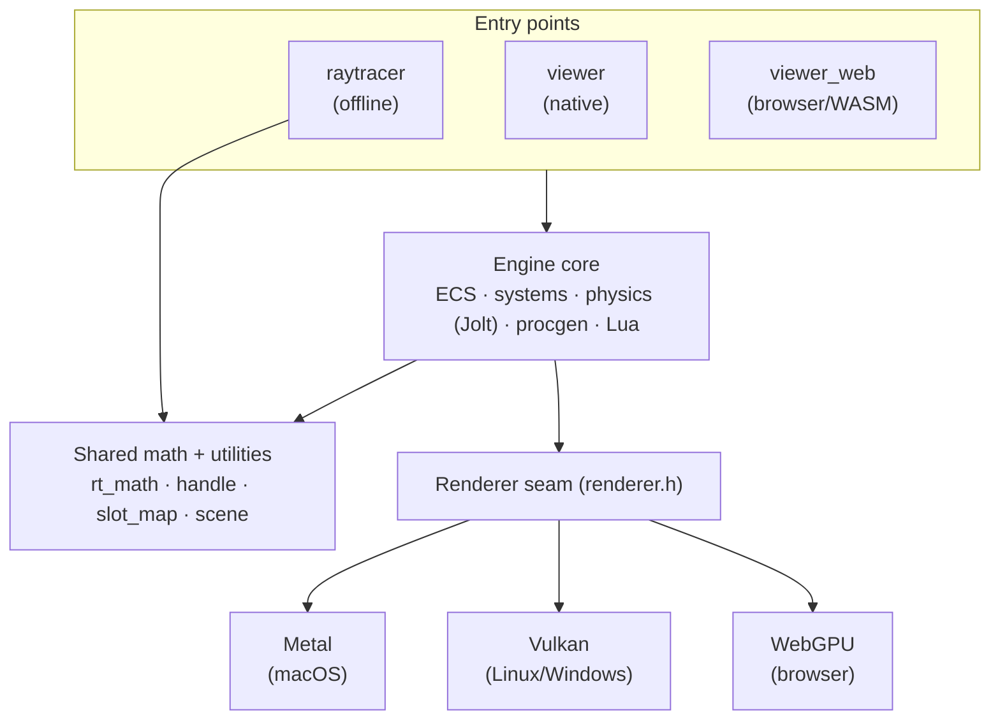

# Raytracer / Realtime Engine

> **100% AI-written.** Every line of this project was written by AI (Anthropic's
> Claude — Opus and Fable), prompted from start to finish; the author has not
> written a single line of code by hand. It's a personal experiment in how far
> you can get building a modern rendering and game engine purely by prompting —
> and then using it as a personal toolchain to explore procedural generation and
> simulation.

A from-scratch C++17 renderer and game engine, built with only the standard
library and a handful of vendored single-header/submodule dependencies. It ships
three programs from a shared core:

- **`raytracer`** — an offline CPU path tracer. Renders a scene to a PNG/PPM
  image. Unbiased Monte Carlo with next-event estimation, physical lens model,
  and HDR image-based lighting.
- **`viewer`** — a realtime, playable 3D engine. ECS world, physics (Jolt), Lua
  scripting, procedural generation (terrain, L-system flora, cities, roads), and
  a GPU renderer behind a platform-neutral seam (Metal on macOS; **Vulkan for
  Linux/Windows is in progress** — see [ADR-0057](docs/decisions.md) and
  [docs/vulkan-renderer-plan.md](docs/vulkan-renderer-plan.md)).
- **`viewer_web`** — the same engine compiled to **WebAssembly**, rendering
  through **WebGPU** in the browser (ADR-0058). Runs the full realtime pipeline
  and gameplay; ships as a scene gallery + in-browser viewer. Build it with
  [docs/web-build.md](docs/web-build.md).

The two paths share scene/level loading, materials, lights, and the entire
procedural-generation substrate. They differ only in the renderer — the offline
path traces, the viewer rasterizes — by design (see `AGENTS.md`, "Procgen
Authoring").

---

## Features

### Offline path tracer (`raytracer`)
- Unbiased Monte Carlo path tracing with next-event estimation (explicit light
  sampling) on a job-system thread pool.
- KD-tree acceleration; instancing.
- Materials: diffuse, metal, glass (Fresnel), emissive.
- Lights: directional (sun), point, spot — in physical units (ADR-0017),
  matched to the realtime path.
- HDR environment lighting from equirectangular `.hdr` maps, with dominant-sun
  extraction; ACES display transform.
- Physical lens model (ADR / `docs/virtual-camera-plan.md`): focal length,
  f-stop, focus distance → thin-lens depth of field, barrel/pincushion
  distortion, chromatic aberration.
- Renders procedural scenes (terrain + hero parametric trees) through the same
  generators the viewer uses.
- Output: PNG (via bundled `stb_image_write`), or P3 PPM with `--out scene.ppm`.

### Realtime engine (`viewer`)
**Rendering** (current Metal backend; Vulkan targets 1:1 parity):
- Forward PBR shading — albedo / metallic / roughness / emission, plus albedo,
  normal, metallic-roughness, emissive, and AO texture maps; per-vertex tint.
- An analytic procedural-surface library (brick, concrete, stucco, roof
  tile/shingle, corrugated metal, asphalt, pavement, cobblestone, wood siding,
  road lane markings) selected per-material with no texture maps.
- Lights: directional / point / spot in physical units; cascaded shadow maps
  with PCF and artistic tint/strength.
- Environment: procedural analytic sky with day/night cycle and FBM clouds,
  **or** a baked cubemap from an equirectangular HDR; image-based lighting
  (irradiance + prefiltered specular + BRDF LUT); reflection probes with
  parallax correction.
- Screen-space post: SSAO (temporal), SSR, bloom, tone mapping (ACES / AgX) +
  color grade, lens effects (distortion / chromatic aberration / vignette) and
  depth of field; aerial-perspective fog.
- Instanced rendering (vegetation/scatter) with height-weighted wind sway;
  CDLOD terrain with vertex morphing; alpha-tested foliage with a depth prepass.
- Debug views (AO/SSR/depth/normals/shadow/albedo/facing), wireframe overlay,
  stats HUD.

**Engine**:
- Sparse-set ECS world; fixed-timestep simulation with interpolation (ADR-0002).
- Jolt-backed rigid-body physics (cross-platform, headless-testable).
- Lua scripting layer (`ScriptVM`, ADR-0023) — procedural recipes authored as
  data and hot-reloadable.
- Procedural generation: noise/terrain, L-system botany, SDF tools, parametric
  trees, a road network (spline graph → polygon join engine), and city
  generation.
- Input: keyboard/mouse + gamepad (Apple GCController on macOS, GLFW joystick
  elsewhere); named-action input mapping.
- Optional Dear ImGui debug overlay; optional Qt6 editor app.

---

## Architecture at a glance

The engine is organized around **backend-neutral seams**: engine, ECS, physics,
procgen, and scripting are written once against abstract interfaces, and
platform-specific code lives *behind* those interfaces (one implementation per
platform, selected at build time). The load-bearing seam is the **`Renderer`** —
the same engine drives Metal, Vulkan, or WebGPU by linking a different
implementation, with no `#ifdef`s in engine code.



How the three GPU backends relate, how shaders are handled (three hand-written
trees — MSL / GLSL→SPIR-V / WGSL), what a frame does (the render graph), and a
glossary of terms (swapchain, HDR target, bind group, …) are all in
**[docs/rendering.md](docs/rendering.md)**.

---

## Build

### Prerequisites
- **C++17 compiler** — `clang++` is the project standard (`g++` and MSVC also
  work). 
- **CMake ≥ 3.16** and a build tool (`make` or Ninja) for the viewer.
- **Git submodules** (Jolt, Dear ImGui, Lua):
  ```bash
  git submodule update --init --recursive
  ```
- **Per platform, for the `viewer`:**
  - **macOS:** Xcode command-line tools (Metal/MetalKit/Cocoa are part of the
    SDK). GLFW (`brew install glfw`).
  - **Linux:** GLFW + the Vulkan SDK and X11/Wayland dev headers, e.g. on
    Debian/Ubuntu:
    `sudo apt install cmake clang libglfw3-dev libvulkan-dev vulkan-tools glslang-tools spirv-tools`
  - **Windows:** the [Vulkan SDK](https://vulkan.lunarg.com/) (headers, loader,
    `glslc`) and GLFW via [vcpkg](https://vcpkg.io) (`vcpkg install glfw3`). Build
    with **clang** (CMake defaults to MSVC, which rejects the project's `-Wextra`).
    The Qt **editor** additionally needs `vcpkg install qtbase`. Full recipe —
    toolchain, configure, running the viewer + editor — in
    **[docs/windows-build.md](docs/windows-build.md)**.

> **Note:** the Vulkan backend is under construction (ADR-0057). On non-Apple
> platforms today the `viewer` links a `NullRenderer` (window + UI run, nothing
> is drawn). The build commands below are the same once Vulkan lands; what you
> install now (Vulkan SDK + GLFW) is what it will use.

### Offline path tracer (no GPU needed — builds anywhere)
The `Makefile` builds the tracer and the unit tests with just `clang++`:
```bash
make            # debug build  -> ./raytracer
make release    # optimized build
make test       # Jolt-free unit tests (math, ECS, input, camera)
make clean
./raytracer                 # renders output.png
./raytracer --out scene.ppm # P3 PPM instead
```
(The tracer also builds via CMake as the `raytracer` target.)

### Web build — browser / WebGPU (`viewer_web`)
Compiles the engine to WebAssembly and renders through WebGPU. Needs the
[Emscripten SDK](https://emscripten.org); no GPU drivers required to build. Short
version (full step-by-step in **[docs/web-build.md](docs/web-build.md)**):
```bash
source /path/to/emsdk/emsdk_env.sh                     # activate the toolchain
emcmake cmake -S . -B build-web -DCMAKE_BUILD_TYPE=Release
cmake --build build-web --target viewer_web            # -> viewer_web.{js,wasm,data}
python3 -m http.server --directory build-web 8000      # serve (WebGPU needs http://localhost)
# open http://localhost:8000/
```

### Full build — viewer, physics, tests (CMake)
The **same commands on every platform**; CMake picks the GPU backend per OS
(Metal on Apple, Vulkan elsewhere once it lands, `NullRenderer` as fallback):
```bash
git submodule update --init --recursive
cmake -S . -B build
cmake --build build
ctest --test-dir build          # unit + physics tests
./build/viewer                  # boots into play; --edit for edit mode
./build/viewer --play level.json
```

### Build options
| Option | Default | Effect |
| --- | --- | --- |
| `RT_ENABLE_PHYSICS` | `ON` | Jolt physics + its headless tests (cross-platform). |
| `RT_ENABLE_SCRIPTING` | `ON` | Lua scripting layer (pure C, cross-platform). |
| `RT_ENABLE_IMGUI` | `OFF` | Dear ImGui debug overlay. |

The `viewer` target builds only where GLFW is found. A Qt6 install additionally
enables the `editor_app` target.

### Debug instruments (environment variables)
Every build carries a few load-time instruments for "where did the generator
put things?" questions. Set the variable, launch the viewer on a level, read
the log (`[probes]`, `[furniture]` lines) or open the file it wrote.

| Variable | What it does |
| --- | --- |
| `RT_CITY_SVG=<path>` | Writes the **layered city map**: everything the generators built, one `<g id="layer-…">` each — streets by class (stroke = carriageway width), the mesher's own **curb loops and sidewalk band** (from its audit, so the sidewalks drawn are the ones built), band gaps at non-street mouths, the nav graph (thin cyan; where cyan leaves the grey, planner and mesher disagree), signal poles (red, tick = facing) and lamps (amber), planted objects (trees green, furniture purple), blocks, lots, building plan polygons, districts (lots tinted by district, hub rings + labels), places, and **conflicts** — every place the sidewalk band lies inside an at-grade carriageway (red X, numbered deepest first, also logged as a census), a legend with counts and a 200 m bar. `RT_CITY_SVG_LAYERS=roads,sidewalks,furniture` draws only those; opened in a browser, every legend row toggles its layer. Also live from the socket: `citymap <path> [layers]`, MCP `city_map`. 1 unit = 1 m, `y` = world Z. |
| `RT_FURNITURE_SVG=<path>` | The furniture-centric preset of the map above (streets + nav + poles). |
| `RT_SKY_SVG=<path>` | Writes the day's **sky chart**: the sun's and moon's altitude/azimuth arcs with hour ticks, sunrise/sunset and moonrise/moonset on the rim, both bodies at the current hour, a phase glyph and legend — in the street map's orientation (east right, south down; rim = horizon, centre = zenith). Also live via `daynight chart <path>` on the control socket, and as the in-game *Sky HUD* (Debug → Day / Night: a compass strip with ☀/☾ at their bearings relative to the camera, plus the chart). |
| `RT_GROUND_PROBES=1` | Plants a post every ~1/96 of the world on the analytic terrain height and scores each against the rendered tile's own interpolation — green flush (≤ 0.3 m), orange (≤ 1 m), red beyond — and logs the histogram plus the worst offender's coordinates. The "does the mesh agree with the function?" test for any level. |
| `RT_NO_ROADS=1`, `RT_NO_BUILDINGS=1`, `RT_NO_CLOUDS=1` | Layer gates: skip that generator/pass so a symptom can be attributed to one layer. |
| `RT_DUMP_DRAWS=1` | Per-frame draw audit (batches, culls, material sets) on the Vulkan backend. |
| `RT_FRAME_STATS=<csv>` | Always-on frame ledger capture; render it with `tools/frame-report.py` (see `docs/profiling.md`). |

Example — the metro's city map, plus a PNG preview:
```bash
RT_CITY_SVG=metro.svg ./build/viewer --edit assets/levels/metro_v2_test.json
RT_CITY_SVG=walks.svg RT_CITY_SVG_LAYERS=roads,curbs,sidewalks,furniture ./build/viewer ...
magick metro.svg -resize 2400x2400 metro.png     # ImageMagick; any SVG viewer works too
```
The viewer also opens a control socket (`/tmp/raytracer-viewer-<pid>.sock`,
path in the log) for scripted captures: `camera x y z pitch yaw` and
`shot <png-path>` via `nc -U`; `daynight?` reads the world clock (hour, loop
length, today's sunrise/sunset) and `daynight minutes <n>` sets the loop
length. Full verb list in `docs/control-channel.md`.

### Day / night
The sun is real geometry (`src/engine/day_night_cycle.h`): latitude plus a
day-of-year declination, so a summer day at 40° N is 14.8 h of light and
9.2 h of dark. One full loop takes `dayMinutes` real minutes (default 30 —
about 18.5 lit, 11.5 dark); the citysim's schedules run on the same clock,
in lockstep — jumping the hour re-opens the city at that hour, holding the
sun holds the city's clock. The calendar turns at midnight and the MOON
rides it: its age since the last new moon (`newMoonDay`, default Jan 18)
sets its phase, its brightness, and where it is — a new moon travels with
the sun, a first quarter sets at midnight, a full moon rises at sunset —
and the sky draws the disc lit from the true sun, so the crescent faces the
right way. `daynight day <1-365>` and `daynight moon <age|auto>` on the
socket; the panel reads the phase. Stars come out once the sun is well down:
a procedural field on the celestial sphere (the equatorial frame rotated by
sidereal time), so they wheel about a pole that stands due north at
altitude = latitude, slide with the season, and carry a Milky Way band on
the real galactic plane; a bright moon washes the faint ones and clouds
cover them. Light pollution is a place: inside the city's footprint (its
road graph's bounds) the sky carries a warm glow toward downtown and only
the brighter stars show; `pollutionFalloff` metres past the edge (default
1500) the sky is dark and the Milky Way is out. Panel: *Stars* / *Milky
Way* / *Light pollution*; level JSON `dayNight.lightPollution` (0..1,
default 0.7) and `dayNight.pollutionFalloff`. Mountains cast shadows at
landscape scale through a **terrain horizon map** (`src/engine/procgen/
terrain_horizon.h`): the terrain's height field on a 256² raster, marched
toward the sun (or the moon at night) into "how high is the ridge from
here"; the lit pass shadows anything whose light sits below it, and the
sun disc + its bloom vanish the moment the sun drops behind the ridge from
where you stand (`daynight?` reports `ridge=`/`behind=`). Panel: *Terrain
shadows*. Vulkan; the per-fragment map is not yet bound on Metal/WebGPU.

The offline tracer renders the same moment: `./raytracer --level <level>
--hour 19.1 --eye X Y Z --look X Y Z` lights the level from the cycle (the
sun by day, the moon by night, as a day-shape on the authored intensity)
and makes ray misses the cycle's sky — a CPU port of the viewer's: the
dusk/night palette, the moon disc, the same star field (same hash, same
lattice), `--pollution` glow; `--day`, `--latitude`, `--moon AGE|auto`.
Mountain shadows and the disc behind a ridge need nothing there — shadow
rays hit the terrain.
A level authors it in its JSON: `"dayNight": {"timeOfDay": 0.35,
"dayMinutes": 30, "latitude": 40, "dayOfYear": 172}` (`"enabled": false`
pins the level's static sun). Live: the Debug panel's *Day / Night*
header, or `daynight minutes 10` on the control socket.

---

## Project layout

```
src/
  rt_math, handle, slot_map, log, image, camera, geometry, material, scene,
  kdtree, path_tracer …   — shared core + offline tracer
  renderer/               — RHI seam (renderer.h), window/input, GPU backends
    metal/                — Metal backend (macOS)          [see metal/AGENTS.md]
    vulkan/               — Vulkan backend (Linux/Windows)  [see vulkan/AGENTS.md]
    webgpu/               — WebGPU backend (browser/WASM)   [see webgpu/AGENTS.md]
  engine/                 — ECS, systems, physics, scripting, procgen
  web_main.cpp            — Emscripten entry point (viewer_web)
shaders/
  metal/                  — Metal Shading Language (MSL) sources
  vulkan/                 — GLSL → SPIR-V (compiled offline)
                            (WebGPU WGSL is embedded in webgpu_renderer.cpp)
web/                      — browser front-end: gallery (index.html) + viewer.html
docs/
  rendering.md            — how the 3 GPU backends / shaders / frame work
  web-build.md            — step-by-step WebGPU/WASM build guide
  decisions.md            — Architecture Decision Records (ADRs)
  ROADMAP.md              — multi-tier development plan
  *-plan.md               — per-feature design docs
```

## Documentation
- **[docs/rendering.md](docs/rendering.md)** — how the three GPU backends relate,
  how shaders work, what a frame does (the render graph), and a glossary
  (swapchain, HDR target, bind group, …). Start here for the renderer.
- **[docs/web-build.md](docs/web-build.md)** — step-by-step WebGPU/WASM build.
- **`AGENTS.md`** — engineering standards, conventions, and the load-bearing
  engine rules (platform abstraction, procgen authoring, playable scenes).
- **`docs/decisions.md`** — every significant architectural decision, with
  alternatives and revisit triggers.
- **`docs/ROADMAP.md`** — where the project is going.
- Per-area `AGENTS.md` files (`src/renderer/AGENTS.md` and the per-backend
  `metal/`, `vulkan/`, `webgpu/` guides) — focused subsystem internals.

## Conventions (short version)
C++17, clang++, standard library only — no *new* external deps without an ADR.
PascalCase types, camelCase functions/variables, UPPER_SNAKE constants, no
Hungarian notation. Smart pointers for heap ownership. One header + one `.cpp`
per module. Front faces wind **clockwise**. See `AGENTS.md` for the full set.

## License
[MIT](LICENSE). Vendored third-party code under `third_party/` (Jolt, Dear
ImGui, Lua, tinygltf, the stb headers) remains under its own permissive
licenses — see each project's notice.
