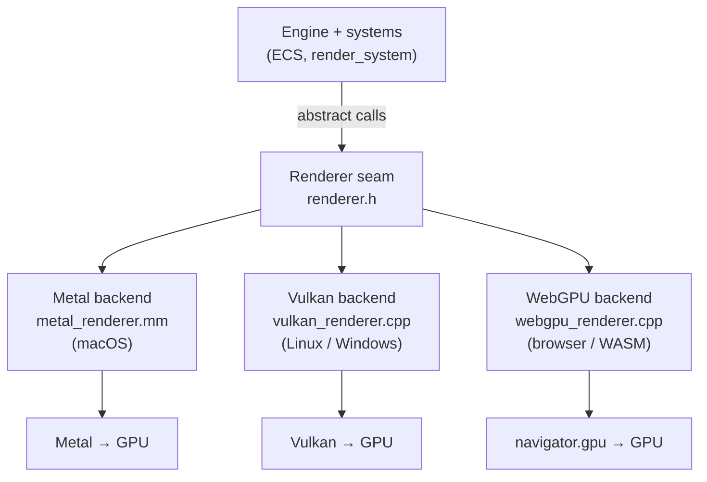
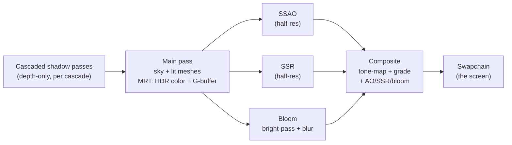

# How the rendering works — backends, shaders, and the frame

This is the conceptual overview of the realtime renderer: how the three GPU
backends relate, how shaders are handled, what a frame does, and a glossary of
the terms that come up (swapchain, HDR target, bind group, …). For build steps
see [web-build.md](web-build.md) / [windows-build.md](windows-build.md); for
backend internals see each backend's `AGENTS.md`.

## The seam: one interface, three backends

The engine never talks to a graphics API directly. It talks to one abstract
interface — the **`Renderer` seam** ([`src/renderer/renderer.h`](../src/renderer/renderer.h)) —
with backend-neutral calls like `uploadMesh`, `setCamera`, `drawMesh`, `endFrame`.
Each platform provides one implementation, and exactly one is linked per build:

`Renderer::create()` has exactly one definition per target (the linker picks the
right one from the platform's source list), so swapping backends never touches
engine code. Adding a platform means writing a new implementation of the seam —
not threading `#ifdef`s through the codebase. This is the load-bearing rule from
[`AGENTS.md`](../AGENTS.md) ("Platform Abstraction").

| Backend | API | Platform | Shader language | Source |
| --- | --- | --- | --- | --- |
| Metal | Metal | macOS/iOS | MSL (Metal Shading Language) | `src/renderer/metal/` |
| Vulkan | Vulkan | Linux/Windows | GLSL → SPIR-V | `src/renderer/vulkan/` |
| WebGPU | WebGPU | browser (WASM) | WGSL (WebGPU Shading Language) | `src/renderer/webgpu/` |

Metal is the **parity reference** — the most mature, feature-complete backend.
Vulkan and WebGPU are ported to match it.

## Shaders: yes, currently bespoke per backend

Each GPU API speaks a different shading language, so today there are **three
parallel, hand-written shader trees**:

- **Metal** — MSL in [`shaders/metal/*.metal`](../shaders/metal) (compiled by the
  Metal driver; embedded as source strings).
- **Vulkan** — GLSL in [`shaders/vulkan/*.{vert,frag}`](../shaders/vulkan),
  compiled **offline** to SPIR-V bytecode as a build step.
- **WebGPU** — WGSL embedded as string literals inside
  [`webgpu_renderer.cpp`](../src/renderer/webgpu/webgpu_renderer.cpp)
  (e.g. `kMeshWgsl`, `kCompositeWgsl`), compiled at runtime by the browser.

They are kept **behaviorally identical** by porting carefully (the WGSL is a
line-for-line port of the proven Vulkan GLSL / Metal MSL), but they are three
separate files that must be edited in lockstep. That three-tree divergence is the
main acknowledged tech-debt risk of having multiple backends (ADR-0058).

**Could there be a single shader source?** We studied it —
[shader-transpile-study.md](shader-transpile-study.md). The finding: transpilers
(glslang → SPIRV-Cross for MSL + Tint for WGSL) *do* produce correct,
production-grade output, so the shaders themselves aren't the problem. The cost is
everything *around* them — each backend's CPU-side resource binding would have to
be rewritten to the generated layout, and the backends' diverging feature sets
consolidated into one superset source. It's a real option, not yet adopted; for
now the trees are hand-maintained.

Note two conventions that differ by backend even in the shaders:

- **Coordinate system.** Metal and WebGPU use a Y-up NDC with a `[0,1]` depth
  range; Vulkan is Y-down with `[0,1]`. So the Vulkan path applies a Y-flip and a
  different cascade fit; Metal/WebGPU don't.
- **No push constants in WebGPU.** Per-draw data (the model matrix, material)
  that Metal/Vulkan push cheaply rides a 256-byte-aligned *dynamic uniform buffer*
  slot in WebGPU instead.

## What a frame does — the render graph

Every backend records the same sequence of GPU passes each frame. The scene is
**not** drawn straight to the screen; it's drawn into an offscreen high-precision
target, post-processed, then a final pass writes the screen. Using the WebGPU
backend's `endFrame` as the reference:

1. **Shadow passes** render scene depth from the sun's point of view, once per
   cascade, into a depth texture array.
2. **Main pass** draws the procedural sky, then the lit geometry, into an
   offscreen **HDR target** (scene-linear color, `RGBA16Float`). It writes two
   outputs at once (*MRT* — multiple render targets): the HDR color and a
   **G-buffer** (world normal + roughness) that the screen-space effects read.
3. **SSAO / SSR / bloom** are screen-space post passes that read the HDR color,
   depth, and G-buffer. SSAO and SSR render at a fraction of full resolution
   (`postEffectScale`) for speed.
4. **Composite** reads the HDR target, folds in AO/SSR/bloom, applies the view
   transform (exposure → color grade → ACES/AgX tone-map), and writes the result
   to the **swapchain** — the image the user sees.

Why the detour through an HDR target? Lighting is computed in unbounded
scene-linear values (the sun can be far brighter than white). Tone-mapping and
all the screen-space effects need those real HDR values; only the very last step
compresses them into the 0–1 range a display shows.

## Concepts / glossary

**Swapchain.** The set of GPU images the GPU draws into and the display shows,
rotated ("swapped") each frame. Think of it as the connection between your
rendering and the actual window/screen surface. A typical setup double- or
triple-buffers: while the display scans out one image, the GPU renders the next;
when the frame is done they swap. In this engine the final **composite** pass
writes the current swapchain image. Notes per backend:
- Vulkan makes the swapchain explicit (you create it, acquire an image, present).
- Metal calls it a `CAMetalLayer` "drawable."
- WebGPU exposes the swapchain as the **canvas surface** — you configure it and
  ask for the current texture; there is *no* explicit "present" call on the web,
  because the browser composites the canvas for you after the frame returns.

**Surface.** The platform's drawable target that the swapchain is created for — a
native window on desktop, the HTML `<canvas>` in the browser. The WebGPU backend
builds its surface from the `#canvas` CSS selector (there is no native window
handle on the web).

**HDR target (offscreen target).** An off-screen texture the scene is rendered
into using high-precision floating-point (`RGBA16Float`) so colors can exceed 1.0.
Post-processing operates on it; the composite pass tone-maps it down to the
display range. Distinct from the swapchain, which is the final low-precision image.

**G-buffer.** A "geometry buffer" — extra per-pixel surface data (here: world
normal + roughness) written during the main pass so later screen-space passes
(SSAO, SSR) can reason about the geometry without re-rasterizing it.

**MRT (multiple render targets).** Writing several output textures from a single
draw — here the main pass emits HDR color *and* the G-buffer in one pass.

**Bind group / descriptor set.** A bundle of GPU resources (uniform buffers,
textures, samplers) made available to a shader as a unit. WebGPU calls it a *bind
group*; Vulkan a *descriptor set*; Metal binds by argument index. Grouping by
update frequency (per-frame globals vs. per-material vs. per-draw) is a standard
performance pattern this engine follows.

**Uniform buffer.** A small, read-only GPU buffer of shader constants (camera
matrices, light list, material parameters). A *dynamic* uniform buffer lets one
buffer hold many slots addressed by an offset per draw — how the WebGPU backend
does per-draw data in the absence of push constants.

**Cascaded shadow maps (CSM).** Shadowing technique that renders scene depth into
several shadow maps covering progressively larger, coarser slices of the view
frustum, so nearby shadows stay crisp while distant ones stay cheap.

**Tone mapping.** The final step that maps unbounded HDR color into the 0–1
display range with a filmic curve (this engine offers ACES and AgX), after
exposure and color grading.

**SwiftShader / software rasterizer.** A CPU implementation of a GPU API used in
CI/headless environments. Relevant caveat: headless software rasterizers don't
composite the WebGPU canvas, so screenshots come back blank even when rendering
succeeds — which is why the web backend is verified *structurally* (no validation
errors, frames pump, readbacks correct) rather than by pixels.
